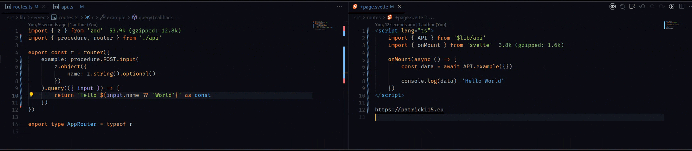

# Sveltekit API

Package for creating [SvelteKit](https://kit.svelte.dev/) API endpoints.
_This package is highly inspired by [TRPC](https://trpc.io)'s structure._

## Showcase



-   First step i creating new API with your context, which will be accesible in every procedure and middleware.
    Also you can export router and basic procedure.
    **src/lib/server/api.ts**

    ```TS

    import { APICreate } from '@patrick115/sveltekitapi'
    import type { Context } from './context'

    export const api = new APICreate<Context>()

    export const router = api.router
    export const procedure = api.procedure

    ```

-   Here you can create your context, which get called on every request and get passed SvelteKit's RequestEvent.

    **src/lib/server/context.ts**

    ```TS
    import type { AsyncReturnType, CreateContext } from '@patrick115/sveltekitapi'

    export const context = (async (ev /*<- SvelteKit's RequestEvent */) => {
        return {} // Here you can put your context
    }) satisfies CreateContext

    export type Context = AsyncReturnType<typeof context>
    ```

-   Now we create router and pass object to it with our procedures. In each procedure we can specify HTTP method (GET, POST, PUT, DELETE, PATCH). For methods other than GET we can specify input schema with .input(ZodSchema). Then we specify what to do with the request with .query(). Parameters for query function are: context and input (in case of method other than GET).

    **src/lib/server/routes.ts**

    ```TS
    import { json } from '@sveltejs/kit'
    import { z } from 'zod'
    import { postProcedure, proc2, procedure, router } from './api'

    export const r = router({
        example: procedure.GET.query(() => {
            return 'Hello from the API!'
        }),
    })

    export type AppRouter = typeof r
    ```

-   At the end we create server and pass in the router, path to API and context.

    **src/lib/server/server.ts**

    ```TS
    import { APIServer } from '@patrick115/sveltekitapi'
    import { context } from './context'
    import { r } from './routes'

    export const Server = new APIServer({
        router: r,
        path: '/api',
        context
    })
    ```

-   If we want to use our API in SvelteKit's endpoint we can do it like this:
    (export const for each method you want to use, in this case GET, POST, PUT, DELETE, PATCH)

    **src/routes/api/[...data]/+server.ts**

    ```TS
    import { Server } from '$lib/server/server'

    export const GET = Server.handler
    export const POST = Server.handler
    export const PUT = Server.handler
    export const DELETE = Server.handler
    export const PATCH = Server.handler

    ```

-   Now syncing with frontend
-   First we create an API client. As type we pass our router type and as parameter we pass rootPath for our API (same as in server).

    **src/lib/api.ts**

    ```TS
    import { createAPIClient } from 'sveltekitapihandler'
    import type { AppRouter } from './server/routes'

    export const API = createAPIClient<AppRouter>('/api')

    ```

-   Syncing with frontend. From load function we return object with our object returned from Server.hydrateToClient() function.

    **src/routes/+layout.server.ts**

    ```TS
    import { Server } from '$lib/server/server'
    import type { LayoutServerLoad } from './$types'

    export const load = (async () => {
        return {
            api: Server.hydrateToClient()
        }
    }) satisfies LayoutServerLoad
    ```

-   Now we need to pass this object to our client

    **src/routes/+layout.svelte**

    ```html
    <script lang="ts">
        import { API } from '$lib/api';
        import type { LayoutData } from './$types';

        export let data: LayoutData;

        API.hydrateFromServer(data.api);
    </script>

    <slot />
    ```

-   Now we can call our API from our frontend

    **src/routes/+page.svelte**

    ```html
    <script lang="ts">
        import { API } from '$lib/api';
        import { onMount } from 'svelte';

        onMount(async () => {
            const res = await API.example.GET.fetch();
            console.log(res);
        });
    </script>

    <h1>Hello from SvelteKit!</h1>
    ```

## Installation

```bash
#npm
npm install @patrick115/sveltekitapi

#pnpm
pnpm install @patrick115/sveltekitapi

#yarn
yarn add @patrick115/sveltekitapi
```
